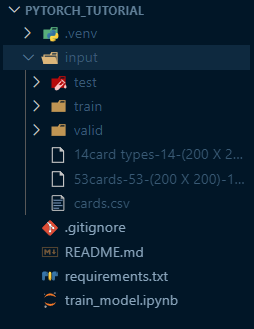

In this notebook we will create an image classifier to detect [playing cards](https://www.kaggle.com/datasets/gpiosenka/cards-image-datasetclassification/data).

Note: To run this notebook, you'd need to download the dataset (code provided in the notebook) and place it in the folder like so: 

This notebook contains the following sections:

1. Create Pytorch Dataset (and Dataloader)
2. Pytorch Model
2.5 Setup datasets
3. Training Loop
4. Evaluate model performance on test set

Selecting the `efficientnet_b3` model and training it for 5 epochs, these were the final results: 

* Train loss: 0.129
* Validation loss: 0.188
* Test loss: 0.136

Indicating little evidence of overfitting.

Credits to [Rob Mulla](https://www.kaggle.com/code/robikscube/train-your-first-pytorch-model-card-classifier) for his Kaggle notebook and this [informative video tutorial](https://www.youtube.com/watch?v=tHL5STNJKag).
